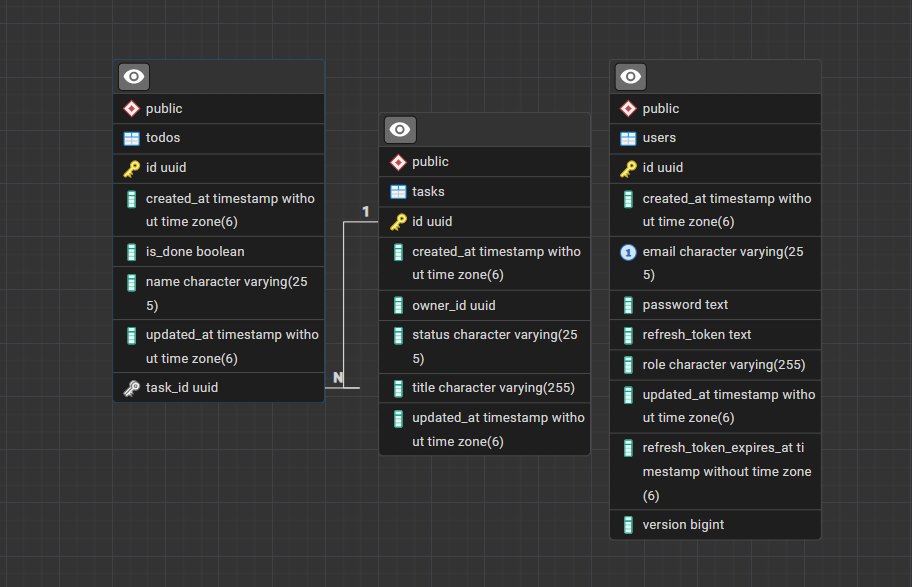

# Tasked

A simple to-do list style task management REST API backend. Followed `Modular Monolith Architecture`. Strictly followed `module boundaries`. Used JWT-based Authentication and Authorization with Role Based Access Control, kept 2 tokens `Access Token` and a `Refresh Token` with rotation policy. User can create task with a title, under task title multiple to-dos can be added. Simple CRUD implemented.

| Technology | Version | Role in this project |
| --- | --- | --- |
| **Java** | 25 | The language |
| **Spring Boot** | 4.1.1 | Wires the whole app together — auto-configuration, dependency management, embedded Tomcat on port 8080, and an executable fat JAR via `spring-boot-maven-plugin` |
| **Spring MVC** | 7.0.9 | The REST layer: `@RestController` endpoints, `@RequestBody` / `@PathVariable` binding, the `@RestControllerAdvice` error handler, and the argument resolver behind `@CurrentUserId` |
| **Spring Security** | 7.1.1 | The auth pipeline: stateless deny-by-default filter chain, JWT bearer validation via OAuth2 Resource Server, `@PreAuthorize` role checks, BCrypt password hashing, and CORS |
| **Spring Data JPA** | 4.1.1 | Repositories without implementations — derived queries scoped by owner, `@EntityGraph` fetches, pessimistic locking for token rotation, and auditing for `created_at` / `updated_at` |
| **Hibernate** | 7.4.5 | The JPA provider underneath: maps the entities to tables, generates the schema (`ddl-auto: update`), and manages the task → todo cascade and orphan removal |
| **PostgreSQL** | driver 42.7.13 | The datastore. Holds `users`, `tasks` and `todos` |
| **Jakarta Bean Validation** | API 3.1.1 (Hibernate Validator 9.1.3) | Declarative input rules on the DTOs — `@NotBlank`, `@Email`, `@Size`, `@Pattern`, `@AssertTrue` — so a bad request becomes a 400 with `fieldErrors` before any service code runs |

## Database

Three tables, generated from the entities by Hibernate. `todos` hangs off `tasks` by a real foreign key
(`task_id`, one-to-many, cascaded and orphan-removed), while `tasks` references its owner by a plain
`owner_id` UUID — no foreign key to `users`, because modules don't join across each other's tables.

## 1. User module

Registration, login, sign-out, refresh rotation, and role management.

### Endpoints — `/users`

| Endpoint | Access | Job | Returns |
| --- | --- | --- | --- |
| `GET /hello` | `USER` | Smoke test | **200** string |
| `POST /` | anonymous | Register (no tokens issued) | **201** string |
| `POST /login` | anonymous | Verify credentials, start session | **200** `{ accessToken, refreshToken }` |
| `POST /refresh-token` | anonymous | Rotate the pair, kill the old token | **200** `{ accessToken, refreshToken }` |
| `POST /signout` | authenticated | Clear the stored refresh hash | **200** `{ message }` |
| `GET /me` | authenticated | The caller's own profile | **200** `UserResponse` |
| `GET /` | `ADMIN` | List all accounts | **200** `UserResponse[]` |
| `PATCH /{id}/role` | `ADMIN` | Change a role, end that user's session | **200** `UserResponse` |

### Errors

| Status | Cause |
| --- | --- |
| **400** | Validation failure (email, password rules, mismatched confirm) · bad JSON or unknown role · non-UUID path id |
| **401** | Missing/expired token · wrong email *or* password (same message, no enumeration) · invalid or already-rotated refresh token · **reuse detected → session revoked** |
| **403** | A `USER` token hitting an admin endpoint |
| **404** | `User not found` |
| **409** | Email already exists · concurrent rotation collision |
| **429** | >10 logins or refreshes per minute per IP |

---

## 2. Task module

Tasks and their checklists — one aggregate, cascaded together.

### Endpoints — `/tasks` (all require `USER`)

| Endpoint | Job | Returns |
| --- | --- | --- |
| `POST /` | Create a task with its checklist, in one transaction | **201** `TaskResponse` |
| `GET /` | Page of the caller's tasks, checklists included, in 2 queries | **200** `PageResponse<TaskResponse>` |
| `GET /{taskId}` | One owned task | **200** `TaskResponse` |
| `PUT /{taskId}` | Replace title + checklist (reconciled by id; tick states survive renames) | **200** `TaskResponse` |
| `PATCH /{taskId}/status` | Change status only | **200** `TaskResponse` |
| `PATCH /{taskId}/todos/{todoId}/done` | Tick / untick one item | **200** `TodoResponse` |
| `DELETE /{taskId}` | Delete task + its todos | **204** no body |

### Errors

| Status | Cause |
| --- | --- |
| **400** | Blank/too-long title or todo name · >100 todos · unknown status · non-UUID path id |
| **401** | Missing or invalid token |
| **403** | Role isn't `USER` — **including `ADMIN`** |
| **404** | `Task not found` (missing *or* owned by someone else) · a todo id that isn't part of this task |
| **409** | Concurrent write collision |

---

## 3. Shared module

Cross-cutting infrastructure.

### Types

| Type | What it's for |
| --- | --- |
| `ApiErrorResponse` | The one error envelope for the whole API |
| `PageResponse<T>` | Stable pagination contract, so Spring's `Page` never leaks into the API |
| `ApiException` + subclasses | `NotFound` 404, `Conflict` 409, `Unauthorized` 401, `TooManyRequests` 429 — services throw without knowing about HTTP |
| `Role`, `TaskStatus` | The shared enums |
| `JwtProperties` | Validated config; **startup fails** if the two secrets match or are too short |
| `@CurrentUserId`, `Policies` | Identity injection and the `@PreAuthorize` expressions, written once |

### Components

| Component | Job | Emits |
| --- | --- | --- |
| `SecurityConfig` | Stateless, deny-by-default filter chain + method security | — |
| `accessTokenDecoder` | Bearer validation against the *access* secret only, zero clock skew | — |
| `AuthRateLimitFilter` | 10 req/min per IP on login + refresh, before any BCrypt work | **429** |
| `JsonAuthenticationEntryPoint` / `JsonAccessDeniedHandler` | Give filter-chain failures the same JSON body as everything else | **401** / **403** |
| `CurrentUserIdArgumentResolver` | Fills `@CurrentUserId` from the verified `sub` | **401** on a bad payload |
| `GlobalExceptionHandler` | Maps every dispatcher exception to a status + body | 400/401/403/404/409 |
| `JwtTokenService`, `TokenSecurityHelper` | Mint/validate tokens; store refresh as `BCrypt(SHA256(token))` | — |

### Error catalog

| Status | Trigger | From |
| --- | --- | --- |
| **400** | Bean Validation (adds `fieldErrors`) · unreadable JSON · type mismatch | `GlobalExceptionHandler` |
| **401** | `UnauthorizedException`, `JwtException` | `GlobalExceptionHandler` |
| **401** | Missing/invalid bearer token | `JsonAuthenticationEntryPoint` |
| **403** | `@PreAuthorize` denial | `GlobalExceptionHandler` |
| **403** | URL-level denial | `JsonAccessDeniedHandler` |
| **404** / **409** | `NotFoundException` · `ConflictException`, unique-index violation, lock failure | `GlobalExceptionHandler` |
| **429** | Rate limit exhausted | `AuthRateLimitFilter` |

> Two sets of handlers because `@RestControllerAdvice` only sees what reaches the dispatcher — auth
> failures happen earlier, in the filter chain.
